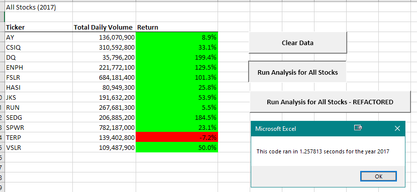
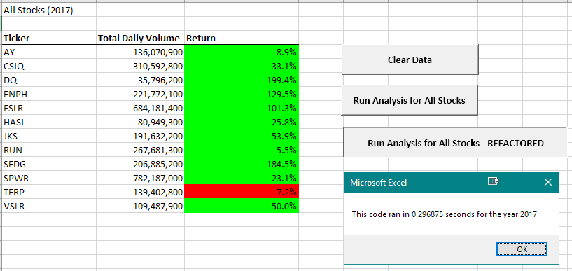
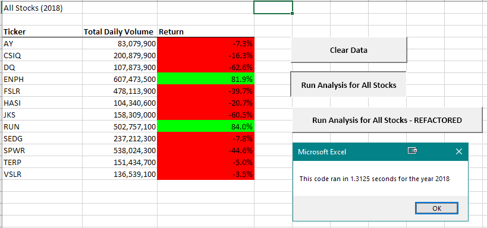
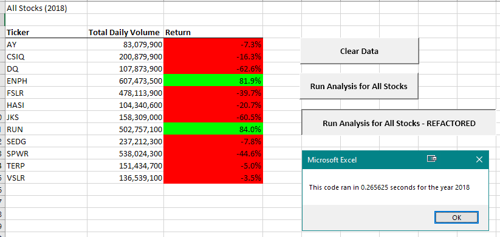

# Stock-Analysis

## Overview of Project: 
Stock analysis VBA script is intended to read in stock data for the year specified by the user and calculate the annual return of each stock in the dataset. This information is for reference only as one should always remember that past performance does not guarantee the future performance.

## Results: 

### Stock market performance comparison between 2017 and 2018

Overall, 2017 was a good year for the stocks included in this analysis. Out of 12 companies, only one stock had a negative return, with the rest having positive returns and 4 companies more than doubling their stock values. The year of 2018 wasn't as kind to the companies from the analysis. Only 2 companies had positive annual returns on their stock values with the rest of the companies seeing the values of their stock decline as compared to the beginning of the year. 

### Refactoring the VBA script
As part of the project, I have refactored the original VBA code. Refactoring the script improved its performance by >300%. While the original script ran in ~1.26-1.31 seconds, the refactored code runs in ~0.27-0.3 seconds:

Year | Original Code            |  Refactored Code
:----|:-------------------------:|:-------------------------:
2017 | | 
2018 | | 

## Summary: 

When making a decision on whether to refactor the code or not, one has to remember that there are both advantages and disadvantages to this process.

### Advantages of Refactoring

- **Improved readability and maintainability**: In the long run, refactoring the code will increase maintenance efficiency by decreasing the time to study and understand the code. It will also make implementing new functionality easier. 
- **Improved performance**: Tidying up the code may improve its performance.

### Disadvantages of Refactoring
- **Time and labor costs**: Refactoring might be time consuming especially when done by someone not familiar with the original code and when original code has poor documentation. 
- **Additional testing**: The code will need to be unit tested again to make sure no bugs were introduced during the refactoring and the code still produces expected results.

Given the short term cost of refactoring the code, it may not be advisable for scripts that are being retired and will not need future functionality updates. Also, it might not be necessary for scripts than run on small datasets where performance is not an issue.

### How do these pros and cons apply to refactoring the original VBA script?
While refactoring this VBA code has improved the performance, it may not be a huge consideration for this specific project as we only have about 3K records and the original script ran fairly fast as well. However, as we increase the number of records, the performance will become of more importance. It will also be easier to maintain the code and add new features in the future. 
